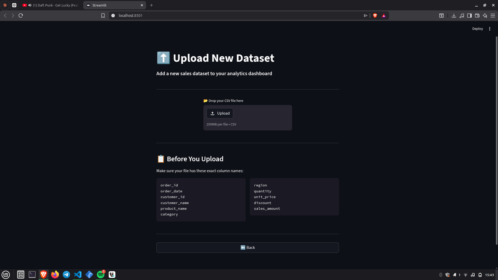
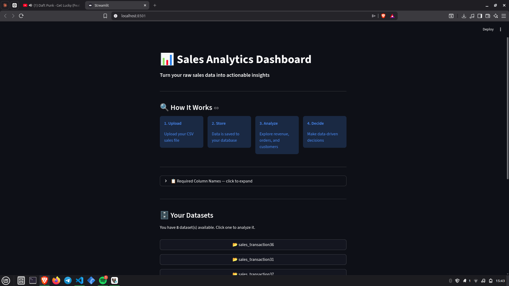
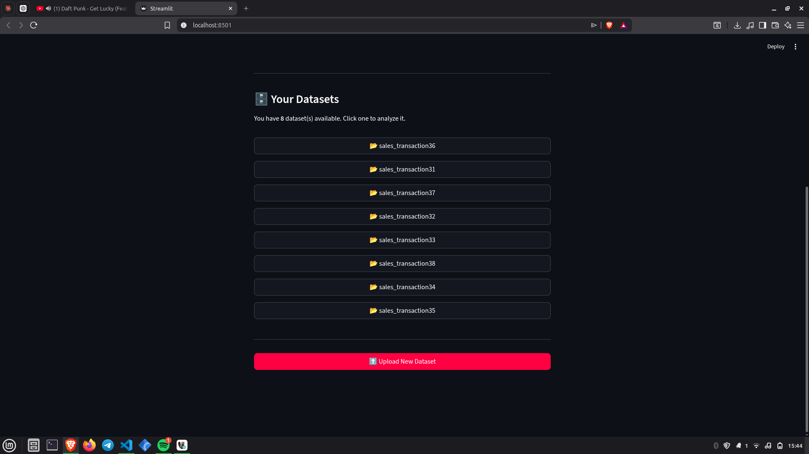
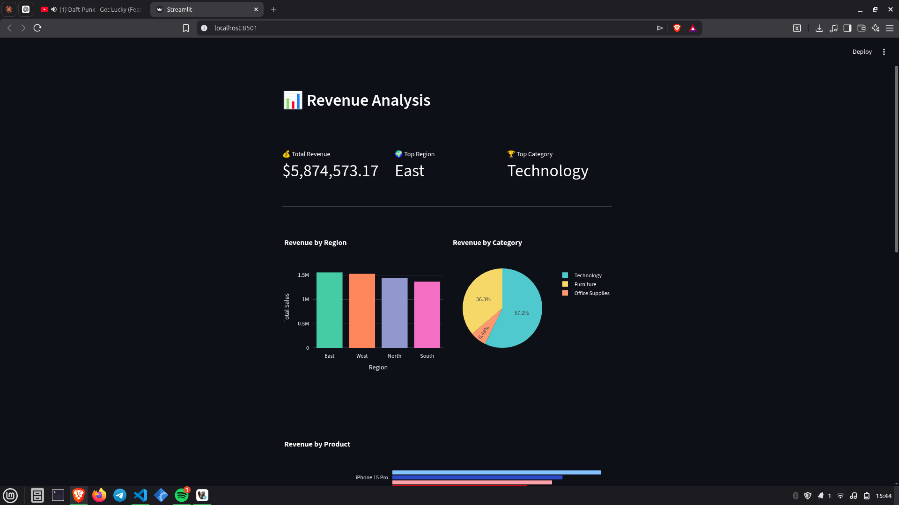
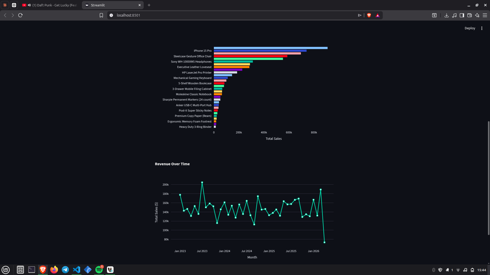
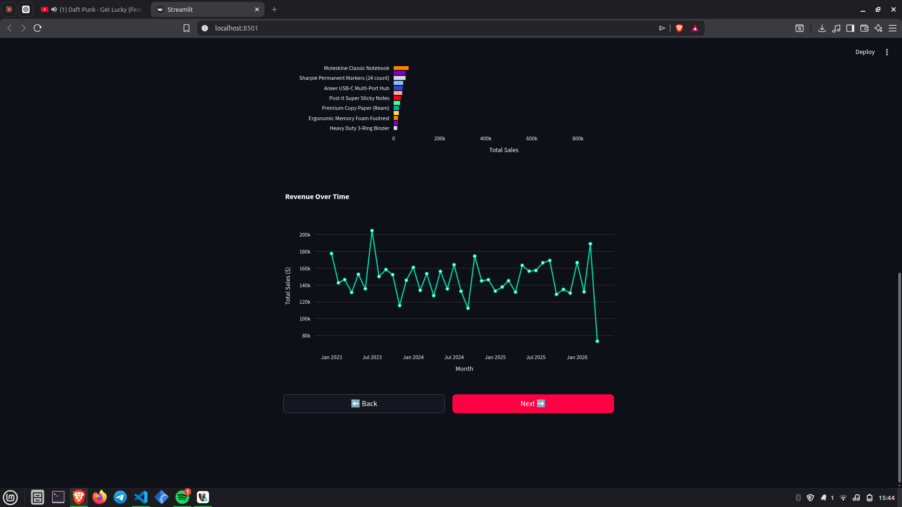
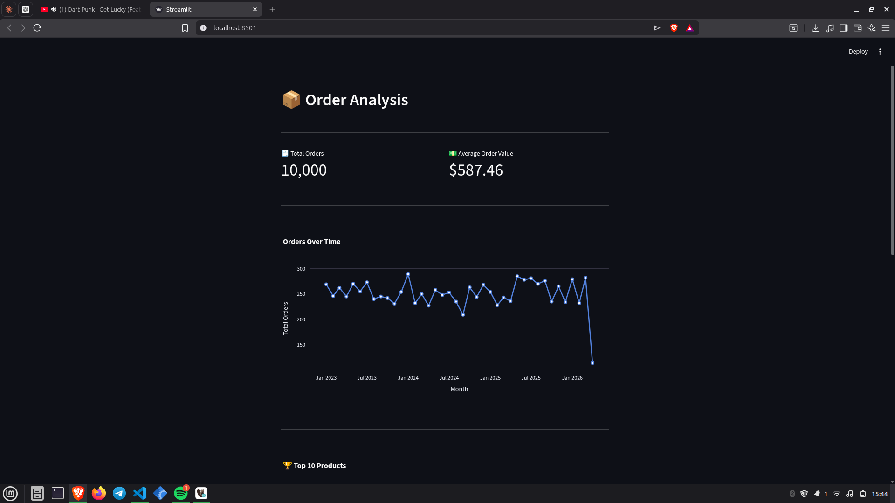
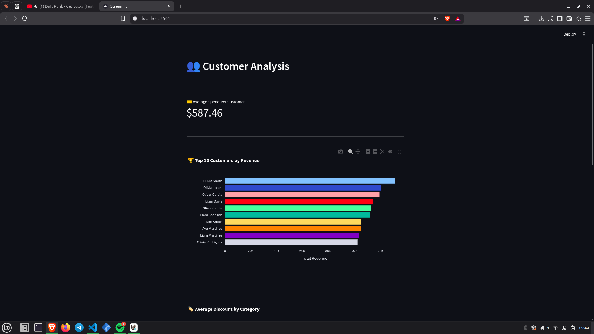
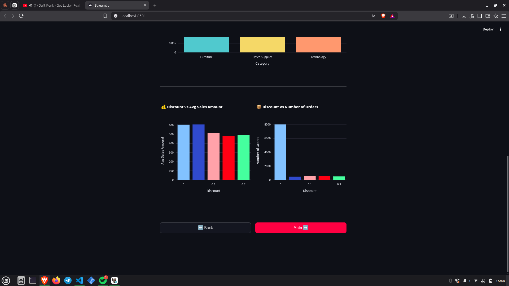

# 📊 Reusable Sales Analytics Dashboard

A production-ready sales analytics web application built with Streamlit and PostgreSQL. Upload any CSV sales dataset, store it in your database, and instantly get a full analytics dashboard with revenue, order, and customer insights.

---

## 🚀 Live Demo

> Upload your CSV → Analyze instantly → Make data-driven decisions



---

## ✨ Features

- **Multi-dataset support** — upload and manage multiple sales datasets in one place
- **Revenue Analysis** — total revenue, revenue by region, category, product, and over time
- **Order Analysis** — total orders, average order value, orders over time, top and worst products
- **Customer Analysis** — top customers by revenue, average spend, discount impact
- **Interactive Charts** — all charts are interactive with hover, zoom, and filter powered by Plotly
- **CSV & Excel Export** — download your cleaned data in any format

---

## 📸 Screenshots

### Main Page — Dataset Manager




### Upload Page


### Revenue Analysis




### Order Analysis



### Customer Analysis



---

## 🛠️ Tech Stack

| Tool | Purpose |
|------|---------|
| [Streamlit](https://streamlit.io/) | Web UI framework |
| [PostgreSQL](https://www.postgresql.org/) | Database |
| [psycopg2](https://pypi.org/project/psycopg2/) | Python-PostgreSQL connector |
| [Pandas](https://pandas.pydata.org/) | Data manipulation |
| [Plotly](https://plotly.com/python/) | Interactive charts |

---

## ⚙️ Installation

### 1. Clone the repository
```bash
git clone https://github.com/biniyamsav/reusable-analytic-dashboard.git
cd reusable-analytic-dashboard
```

### 2. Create and activate virtual environment
```bash
python -m venv venv
source venv/bin/activate        # On Windows: venv\Scripts\activate
```

### 3. Install dependencies
```bash
pip install -r requirements.txt
```

### 4. Set up PostgreSQL
Make sure PostgreSQL is installed and running, then create the database:
```sql
CREATE DATABASE sales_analytics;
```

### 5. Configure your database connection
In `database.py` update these values to match your PostgreSQL setup:
```python
conn = psycopg2.connect(
    host="localhost",
    database="sales_analytics",
    user="your_username",
    password="your_password",
    port=5432
)
```

### 6. Run the app
```bash
streamlit run app.py
```

---

## 📋 CSV Format Requirements

Your CSV file must contain these exact column names:

| Column | Type | Description |
|--------|------|-------------|
| `order_id` | Integer | Unique order identifier |
| `order_date` | Date | Date of the order (YYYY-MM-DD) |
| `customer_id` | Integer | Unique customer identifier |
| `customer_name` | Text | Full name of the customer |
| `product_name` | Text | Name of the product |
| `category` | Text | Product category |
| `region` | Text | Sales region |
| `quantity` | Integer | Number of units ordered |
| `unit_price` | Decimal | Price per unit |
| `discount` | Decimal | Discount applied (0.0 to 1.0) |
| `sales_amount` | Decimal | Total sales value |

> ⚠️ Column names are case-sensitive. Make sure they match exactly.

---

## 📁 Project Structure

```
reusable-analytic-dashboard/
├── app.py              # Main Streamlit app — all pages and navigation
├── database.py         # PostgreSQL connection and all SQL queries
├── querys.py           # Additional query helpers
├── temp.py             # Utility functions
├── requirements.txt    # Python dependencies
├── assets/             # Screenshots for README
└── README.md
```

---

## 🗺️ Roadmap

- [ ] Automatic database setup on first run
- [ ] Column name normalization for flexible CSV formats
- [ ] Date range filters on all charts
- [ ] User authentication
- [ ] FastAPI backend for multi-user support

---

## 👤 Author

Built by **Biniyam** — [github.com/biniyamsav](https://github.com/biniyamsav)
